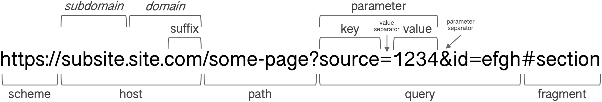

# Setup and Prerequisites


For this tutorial to work properly, you must open the **project from the repository root folder** in RStudio or your IDE.

- ✓ Correct: Open the project from `/path/to/webtracking-data-tutorial/`
- ✗ Incorrect: Opening files individually or from subdirectories

This ensures all relative paths (to data files, helper scripts, etc.) work correctly.


**Before running the code below, make sure you have:**

1. Opened the project from the repository root folder (see above)
2. Downloaded the Web Tracking data (Campusfile) from [ZA5670](https://search.gesis.org/research_data/ZA5670)
3. Placed the data files in the `data/` folder:
   - `ZA5670_webtracking_data.csv`
   - `ZA5670_survey_data.csv`

## Install and Load Packages

Run this chunk to install (if needed) and load all required packages. This may take a few minutes on first run.

```{r install-packages, message=TRUE}
# Required packages
required_packages <- c(
  "tidyverse",    # Data manipulation and visualization
  "webtrackR",    # Web tracking data functions
  "adaR",         # URL parsing
  "here"          # Path management
)

# Install missing packages
new_packages <- required_packages[!(required_packages %in% installed.packages()[,"Package"])]
if(length(new_packages) > 0) {
  cat("Installing:", paste(new_packages, collapse = ", "), "\n")
  install.packages(new_packages, repos = "https://cloud.r-project.org/")
}

# Load all packages
cat("Loading packages...\n")
suppressPackageStartupMessages({
  library(tidyverse)
  library(webtrackR)
  library(adaR)
  library(here)
})

cat("✓ All packages loaded\n\n")
```

## Setup Data

The GESIS Web Tracking data contains only host-level information. We'll create an enhanced dataset with synthetic full URLs to practice URL parsing and classification. This takes 2-3 minutes on the first run.

```{r setup, include=TRUE, message=TRUE}
knitr::opts_chunk$set(echo = TRUE, warning = FALSE, message = FALSE, results = "hold")

# Check R version (minimum 4.0.0)
if (getRversion() < "4.0.0") {
  warning("This tutorial requires R >= 4.0.0. You have ", getRversion())
}

# Load data functions and create enhanced dataset
# Use here::here() to find load_data.R from project root (works when knitting)
source(here::here("scripts", "load_data.R"))

cat("✓ Setup complete!\n\n")
```


# Introduction

In this code along, we will work with the demo Web Tracking data from the GESIS panel.dbd (Campusfile: [ZA5670](https://search.gesis.org/research_data/ZA5670)). Note that the data has been augmented with synthetic full-URLs for demonstration purposes. The original dataset contains only host level visit information. The enhanced dataset includes synthetic full URLs for all entries to allow us to practice URL parsing and classification.
We will cover data loading, cleaning, and basic analysis using R. This tutorial focuses on **preprocessing web tracking data**, i.e., the essential steps you need before any analysis. The raw records in web tracking data are **traces**, i.e., individual logged URL hits that include browser artifacts, redirects, and duplicates. A key preprocessing goal is transforming these traces into meaningful **visits** through deduplication and cleaning. We'll learn how to parse URLs, clean messy data, classify visits, and aggregate browsing behavior.

**What we'll cover:**

- Loading and understanding web tracking data structure
- Parsing URL components (domain, path, query parameters)
- Turning raw traces into visits through deduplication
- Classifying visits into meaningful categories
- Aggregating visit statistics by panelist
- Linking web tracking data with survey responses

**What we won't cover**:

- Statistical modeling (regression, etc.)
- Sequence analysis

Make sure you have downloaded the data and placed it in the `data/` folder as per the setup instructions.


# Working with web tracking data

## Loading and understanding the dataset

We'll take a look at the enhanced web tracking dataset and explore its structure.


```{r examine-data}
# Examine data structure
cat("=== Dataset Structure ===\n")
glimpse(wt_data)

cat("\n=== First 10 rows ===\n")
head(wt_data, 10)


```

We'll also check what time range our data is covering:

```{r check-time-range}
# Check time range
# Parse timestamps (ISO format with timezone)
wt_data <- wt_data %>%
  mutate(timestamp = as.POSIXct(start_time, format = "%Y-%m-%d %H:%M:%S"))

cat("\n=== Time Range ===\n")
cat("Start:", format(min(wt_data$timestamp, na.rm = TRUE), "%Y-%m-%d %H:%M"), "\n")
cat("End:", format(max(wt_data$timestamp, na.rm = TRUE), "%Y-%m-%d %H:%M"), "\n")
cat("Duration:",
    as.numeric(difftime(max(wt_data$timestamp, na.rm = TRUE),
                        min(wt_data$timestamp, na.rm = TRUE),
                        units = "days")),
    "days\n")


```

Now let's examine our panelists and traces in more detail. We'll count the total number of traces, unique panelists, and look at the distribution of traces per panelist. We'll also check the time range of the data to understand how long the tracking period is. Finally, we'll look at the distribution of traces per day per panelist to see if there are any temporal patterns in the data.

```{r}

# Count unique panelists
n_panelists <- n_distinct(wt_data$panelist_id)
cat("\n=== Basic Statistics ===\n")
cat("Total traces:", format(nrow(wt_data), big.mark = ","), "\n")
cat("Unique panelists:", n_panelists, "\n")

# Show traces per panelist (summary statistics)
cat("\n=== Traces per Panelist ===\n")
visits_per_panelist <- wt_data %>%
  count(panelist_id, name = "traces") %>%
  pull(traces)

cat("Mean:", round(mean(visits_per_panelist), 1), "\n")
cat("Median:", median(visits_per_panelist), "\n")
cat("Min:", min(visits_per_panelist), "\n")
cat("Max:", format(max(visits_per_panelist), big.mark = ","), "\n")

# Show traces per day per panelist
wt_data <- wt_data %>%
  mutate(date = as.Date(timestamp))

cat("\n=== Traces per Day per Panelist ===\n")
visits_per_day <- wt_data %>%
  group_by(panelist_id, date) %>%
  summarise(traces = n(), .groups = "drop") %>%
  pull(traces)

cat("Mean:", round(mean(visits_per_day), 1), "\n")
cat("Median:", median(visits_per_day), "\n")
cat("Max:", max(visits_per_day), "\n")


```


Of course, we can also visualize this data to get a better sense of the distribution of traces and temporal patterns:


```{r visualize-data-traces-per-user, fig.width=8, fig.height=5}
# Distribution of traces per panelist
traces_per_user <- wt_data %>%
  count(panelist_id, name = "traces")

ggplot(traces_per_user, aes(x = traces)) +
  geom_histogram(bins = 50, fill = "steelblue", color = "white") +
  scale_x_continuous(labels = function(x) format(x, big.mark = ",", scientific = FALSE)) +
  labs(
    title = "Distribution of Traces per Panelist",
    x = "Number of Traces",
    y = "Number of Panelists"
  ) +
  theme_minimal()
```


```{r visualize-data-traces-over-time, fig.width=10, fig.height=5}
# Traces over time (daily counts)
traces_over_time <- wt_data %>%
  count(date, name = "traces")

ggplot(traces_over_time, aes(x = date, y = traces)) +
  geom_col(fill = "steelblue", width = 1) +
  scale_y_continuous(labels = function(x) format(x, big.mark = ",", scientific = FALSE)) +
  labs(
    title = "Web Tracking Traces Over Time",
    x = "Date",
    y = "Number of Traces"
  ) +
  theme_minimal() +
  theme(axis.text.x = element_text(angle = 45, hjust = 1))
```

```{r visualize-data-traces-day-time, fig.width=10, fig.height=5}
# Traces by hour of day
traces_by_hour <- wt_data %>%
  mutate(hour = as.numeric(format(timestamp, "%H"))) %>%
  count(hour, name = "traces")

ggplot(traces_by_hour, aes(x = hour, y = traces)) +
  geom_col(fill = "steelblue") +
  scale_x_continuous(breaks = 0:23) +
  scale_y_continuous(labels = function(x) format(x, big.mark = ",", scientific = FALSE)) +
  labs(
    title = "Web Tracking Activity by Hour of Day",
    x = "Hour of Day (0-23)",
    y = "Number of Traces"
  ) +
  theme_minimal()
```

```{r visualize-data-traces-by-weekday, fig.width=8, fig.height=5}
# Traces by day of week
traces_by_weekday <- wt_data %>%
  mutate(
    weekday = weekdays(timestamp),
    weekday = factor(weekday,
                     levels = c("Monday", "Tuesday", "Wednesday",
                               "Thursday", "Friday", "Saturday", "Sunday"))
  ) %>%
  count(weekday, name = "traces")

ggplot(traces_by_weekday, aes(x = weekday, y = traces)) +
  geom_col(fill = "steelblue") +
  scale_y_continuous(labels = function(x) format(x, big.mark = ",", scientific = FALSE)) +
  labs(
    title = "Web Tracking Activity by Day of Week",
    x = "Day of Week",
    y = "Number of Traces"
  ) +
  theme_minimal() +
  theme(axis.text.x = element_text(angle = 45, hjust = 1))
```


The data contains not only full URLs but also entries that are just domains or privacy placeholders. This is common in web tracking data due to privacy settings and browser behavior. Understanding this heterogeneity is crucial for preprocessing and analysis. Let's categorize the URLs into types and see how many traces fall into each category. This will help us understand the composition of our dataset and inform our parsing and classification strategies. We'll also show sample URLs from each type to illustrate the differences.

```{r annotate-url-type}

# Annotate URL type (3 categories)
wt_data <- wt_data %>%
  mutate(
    url_type = case_when(
      url %in% c("blacked_out", "full_deny") ~ "Privacy placeholder",
      str_detect(url, "^https?://") | str_detect(url, "/") ~ "Full URL",
      TRUE ~ "Domain only"
    )
  )

# Show URL type distribution
cat("=== URL Type Distribution ===\n")
wt_data %>%
  count(url_type, sort = TRUE) %>%
  mutate(
    percentage = paste0(round(n / sum(n) * 100, 1), "%")
  ) %>%
  print()

# Show sample URLs from each type
cat("\n=== Sample URLs by Type ===\n")
wt_data %>%
  group_by(url_type) %>%
  slice_sample(n = 3) %>%
  select(url_type, url) %>%
  ungroup() %>%
  arrange(url_type) %>%
  print(n = 15)
```


## URL anatomy and parsing

URLs contain rich information encoded in their structure. We'll break them down into components (protocol, host, domain, path, query parameters) and learn how to extract each piece. We'll show both manual tidyverse approaches and webtrackR's built-in functions.

Because the data contains only the hostname / domain for some visits, we'll need to add a protocol to parse the URLs properly. This is a common issue with web tracking data where some entries are just domains without protocol or path for privacy reasons. Therefore, we want to add `https://` to all entries in the `url` column to ensure consistent parsing. This way, we can use URL parsing functions that expect a full URL format.

```{r add-protocol}
# Add http:// protocol to URLs that don't have one for consistent parsing
# Skip privacy placeholders and special browser URLs

wt_data <- wt_data %>%
  mutate(
    url = case_when(
      # Keep privacy placeholders as is
      url %in% c("blacked_out", "full_deny") ~ url,
      # Already has a protocol (http://, https://, chrome://, about:, etc.) - keep as is
      str_detect(url, "^[a-z][a-z0-9+.-]*:") ~ url,
      # Add http:// to everything else (domain-only URLs)
      TRUE ~ paste0("https://", url)
    )
  )

```

Now, we can begin dissecting the URLs into their components. While we could use manual string manipulation with regex and tidyverse functions, we'll primarily rely on webtrackR's built-in URL parsing functions for robustness and ease of use. These functions can handle edge cases and inconsistencies in the data more effectively than manual approaches.





```{r ada-parse}
# Using adaR to parse URL components
# adaR provides individual extraction functions and a comprehensive parser

# Get protocol (scheme)
cat("=== Top 20 Protocols ===\n")
wt_data %>%
  mutate(protocol = ada_get_protocol(url)) %>%
  count(protocol, sort = TRUE) %>%
  head(20) %>%
  print()

# Get host (domain + port)
cat("\n=== Top 20 Hosts ===\n")
wt_data %>%
  mutate(host = ada_get_host(url)) %>%
  count(host, sort = TRUE) %>%
  head(20) %>%
  print()

# Get hostname (domain without port)
cat("\n=== Top 20 Hostnames ===\n")
wt_data %>%
  mutate(hostname = ada_get_hostname(url)) %>%
  count(hostname, sort = TRUE) %>%
  head(20) %>%
  print()

# OR: Parse all components at once with ada_url_parse()
cat("\n=== Sample of Parsed URL Components ===\n")
url_components <- ada_url_parse(head(wt_data$url, 50))
print(url_components |> filter(href!='blacked_out' & href!='full_deny'))

cat("\nColumns returned by ada_url_parse():\n")
cat(paste(names(url_components), collapse = ", "), "\n")
```

We can also use `adaR` to check and modify URLs. For more information, see the [adaR documentation](https://gesistsa.github.io/adaR/).


You can also use the `webtrackR` package to extract specific components. The package automatically takes care of missing protocols and then calls `adaR` under the hood.

```{r webtrackr-parse}
# Using webtrackR to extract URL components
# webtrackR adds new columns to the dataset and returns the modified data frame

# Before using webtrackR functions, we need to convert our data frame to a webtrackR dataset with appropriate timestamp parsing and variable names.

wtr_data <- wt_data %>%
    select(-timestamp) %>% # Remove previously parsed timestamp to avoid confusion
      as.wt_dt(
          timestamp_format = "%Y-%m-%d %H:%M:%OS",
          tz = "UTC",
          varnames = c(panelist_id = "panelist_id", url = "url", timestamp = "start_time")
        )

# Extract host (automatically handles missing protocols via adaR)
wtr_data <- extract_host(wtr_data, varname = "url")

# Extract domain (top-level domain)
wtr_data <- extract_domain(wtr_data, varname = "url")

# Extract path
wtr_data <- extract_path(wtr_data, varname = "url")


# Show results
cat("=== Top 20 Domains ===\n")
wtr_data %>%
  count(domain, sort = TRUE) %>%
  head(20) %>%
  print()

cat("\n=== Sample of Extracted Components ===\n")
wtr_data %>%
  select(url, host, domain) %>%
  filter(!is.na(domain)) %>%
  slice_sample(n = 10) %>%
  print()

cat("\nNote: webtrackR's extract_domain() returns the 'top private domain',")
cat("\ne.g., 'mysite.blogspot.com' not 'blogspot.com'\n")
```


An added benefit of using `webtrackR` is that it allows us to call `summary` on the dataset to get a quick overview of the variables and their distributions. This is a useful way to check that our parsing worked as expected and to understand the composition of our data.

```{r webtrackr-summary}
# Show summary of webtrackR dataset
cat("=== Summary of webtrackR Dataset ===\n")
summary(wtr_data)
```


## Data cleaning and augmentation


### Deduplication: From traces to visits

Raw web tracking data consists of **traces**, individual logged URL hits that include browser artifacts like page refreshes, redirects, and automatic reloads. These are not meaningful page visits. The goal of deduplication is to transform these raw traces into **visits**, i.e., records that represent intentional navigation to a page. Let's first look at what these artifacts look like in our data.

```{r show-artifacts}
# Show consecutive duplicate visits for one panelist
cat("=== Example: Consecutive Visits for One Panelist ===\n")
wtr_data %>% 
  filter(panelist_id == unique(panelist_id)[1]) %>%
  select(panelist_id, timestamp, url) %>%
  head(50) %>%
  print()
```

Some URLs appear multiple times in a row:

```{r show-duplicates}
# Identify consecutive duplicate URLs per panelist
# Find a panelist with consecutive duplicate URLs close in time
dup_example <- wtr_data %>%
  group_by(panelist_id) %>%
  mutate(
    time_diff = as.numeric(difftime(timestamp, lag(timestamp), units = "secs")),
    is_duplicate = !is.na(lag(url)) & url == lag(url) & time_diff <= 2
  ) %>%
  ungroup() %>%
  filter(is_duplicate) %>%
  slice(1)

# Show the surrounding visits for that panelist around the duplicate
wtr_data %>%
  filter(panelist_id == dup_example$panelist_id,
         timestamp >= dup_example$timestamp - 10,
         timestamp <= dup_example$timestamp + 10) %>%
  select(panelist_id, timestamp, url) %>%
  as_tibble() %>%
  print(n = 20)

```

These are typically browser refreshes, redirects, or tracking artifacts rather than genuine separate visits. Before we can identify and remove these duplicate traces, we need to know how much time elapsed between consecutive entries.


```{r add-duration}
# Add visit duration (time until next visit)
# cutoff = 300 means durations > 300 seconds (5 min) are replaced with NA
# (the user likely left the browser)
cat("Traces before cleaning:", format(nrow(wtr_data), big.mark = ","), "\n\n")

wtr_data <- add_duration(wtr_data, cutoff = 300, replace_by = NA)

cat("=== Duration Summary (seconds) ===\n")
summary(wtr_data$duration)
```

The `duration` column now tells us how long each visit lasted (in seconds), calculated as the time difference to the next visit. Durations longer than 5 minutes are set to `NA` since the user likely navigated away or closed the browser.

Let's visualize the distribution of visit durations to understand our data better:

```{r duration-distribution, fig.width=8, fig.height=5}
# Distribution of visit durations (< 60 seconds only for readability)
wtr_data %>%
  filter(!is.na(duration), duration <= 60) %>%
  ggplot(aes(x = duration)) +
  geom_histogram(bins = 60, fill = "steelblue", color = "white") +
  scale_y_continuous(labels = function(x) format(x, big.mark = ",", scientific = FALSE)) +
  labs(
    title = "Distribution of Visit Durations (up to 60 seconds)",
    x = "Duration (seconds)",
    y = "Number of Visits"
  ) +
  theme_minimal()
```

We can see a large spike at very short durations. Many of these are consecutive traces to the same URL, browser artifacts that we want to remove. The `deduplicate()` function from webtrackR identifies consecutive traces to the same URL within a time window and drops them, turning our raw traces into meaningful visits:

```{r deduplicate}
# Drop consecutive visits to the same URL within 3 seconds
wtr_data <- deduplicate(wtr_data, method = "drop", within = 3)

cat("Visits after deduplication:", format(nrow(wtr_data), big.mark = ","), "\n")
```

From here on, our data represents **visits** rather than raw traces. Let's see how the duration distribution changed after cleaning:

```{r after-cleaning, fig.width=8, fig.height=5}
# Duration distribution after deduplication
wtr_data %>%
  filter(!is.na(duration), duration <= 60) %>%
  ggplot(aes(x = duration)) +
  geom_histogram(bins = 60, fill = "steelblue", color = "white") +
  scale_y_continuous(labels = function(x) format(x, big.mark = ",", scientific = FALSE)) +
  labs(
    title = "Visit Durations After Deduplication (up to 60 seconds)",
    x = "Duration (seconds)",
    y = "Number of Visits"
  ) +
  theme_minimal()
```


### Sessions

A browsing session is a sequence of visits without a long gap in between. webtrackR's `add_session()` assigns a session ID to each visit based on a timeout cutoff -- if the gap between two consecutive visits exceeds the cutoff, a new session starts. A common choice is 30 minutes (1800 seconds):

```{r add-session}
wtr_data <- add_session(wtr_data, cutoff = 1800)

cat("=== Sessions ===\n")
n_sessions <- wtr_data %>% distinct(panelist_id, session) %>% nrow()
cat("Total sessions across all panelists:", format(n_sessions, big.mark = ","), "\n")
```

```{r session-stats}
# Sessions per panelist
sessions_per_user <- wtr_data %>%
  group_by(panelist_id) %>%
  summarise(n_sessions = n_distinct(session), .groups = "drop")

cat("=== Sessions per Panelist ===\n")
cat("Mean:", round(mean(sessions_per_user$n_sessions), 1), "\n")
cat("Median:", median(sessions_per_user$n_sessions), "\n")
cat("Min:", min(sessions_per_user$n_sessions), "\n")
cat("Max:", format(max(sessions_per_user$n_sessions), big.mark = ","), "\n")
```

```{r sessions-per-day}
# Sessions per panelist per day
sessions_per_day <- wtr_data %>%
  mutate(date = as.Date(timestamp)) %>%
  group_by(panelist_id, date) %>%
  summarise(n_sessions = n_distinct(session), .groups = "drop")

cat("=== Sessions per Panelist per Day ===\n")
cat("Mean:", round(mean(sessions_per_day$n_sessions), 1), "\n")
cat("Median:", median(sessions_per_day$n_sessions), "\n")
cat("Max:", max(sessions_per_day$n_sessions), "\n")
```

```{r session-distribution, fig.width=8, fig.height=5}
ggplot(sessions_per_user, aes(x = n_sessions)) +
  geom_histogram(bins = 50, fill = "steelblue", color = "white") +
  labs(
    title = "Distribution of Sessions per Panelist (30-min cutoff)",
    x = "Number of Sessions",
    y = "Number of Panelists"
  ) +
  theme_minimal()
```


### URL cleaning

We can also clean up URLs by removing query parameters and fragments. This is useful for grouping visits to the same page regardless of tracking parameters (e.g., `?utm_source=google`):

```{r drop-query}
# Remove query strings and fragments from URLs
wtr_data <- drop_query(wtr_data, varname = "url")

# Show before/after
cat("=== URL Cleaning Examples ===\n")
wtr_data %>%
  filter(url != url_noquery) %>%
  select(url, url_noquery) %>%
  slice_sample(n = 5) %>%
  print()
```


This way we can easily inspect some of the top URLs:

```{r top-urls}

# Show top 20 URLs after cleaning
cat("=== Top 20 URLs After Cleaning ===\n")
wtr_data %>%
    count(url_noquery, sort = TRUE) %>%
    head(20) %>%
    print()
```


**Try it yourself:** What happens if you change the deduplication window from 3 seconds to 5 seconds? How does it affect the number of visits?


## Basic URL classification

Raw URLs are hard to analyze directly. To make sense of browsing behavior, we need to group visits into meaningful categories. There are two main strategies: **domain-based** classification (matching against known domains) and **path-based** classification (using URL path patterns like `/politik/` or `/search?q=`).

We'll start with a simple manual approach using `case_when()` and regex patterns, then show how `webtrackR` streamlines this with `classify_visits()`.

```{r classify-manual}
# Re-extract domain after deduplication (cleaning may drop extra columns)
wtr_data <- extract_domain(wtr_data, varname = "url")

# Manual classification using domain patterns
wtr_data <- wtr_data %>%
  mutate(
    category = case_when(
      str_detect(domain, "spiegel|zeit\\.de|tagesschau|sueddeutsche|faz\\.net|welt\\.de|t-online|heise") ~ "News",
      str_detect(domain, "wikipedia") ~ "Wikipedia",
      str_detect(domain, "amazon|ebay|kleinanzeigen|zalando|otto\\.de") ~ "E-commerce",
      str_detect(domain, "youtube|facebook|instagram|twitter|tiktok|reddit") ~ "Social/Video",
      str_detect(domain, "google|bing|duckduckgo|ecosia|yahoo") ~ "Search",
      is.na(domain) ~ "Other/Unclassified",
      TRUE ~ "Other/Unclassified"
    )
  )

cat("=== Classification Results (Manual) ===\n")
wtr_data %>%
  count(category, sort = TRUE) %>%
  mutate(percentage = paste0(round(n / sum(n) * 100, 1), "%")) %>%
  print()
```

This works, but manually writing regex for every domain is tedious and error-prone. The `classify_visits()` function from webtrackR offers a more structured approach. It takes a classification data frame that maps domains (or regex patterns) to categories:

```{r classify-webtrackr}
# Create a classification list as a data frame
# Each row maps a domain to a category
classification_df <- data.table::data.table(
  domain = c(
    # News
    "spiegel.de", "zeit.de", "tagesschau.de", "sueddeutsche.de",
    "faz.net", "welt.de", "t-online.de", "heise.de", "n-tv.de",
    # Social/Video
    "youtube.com", "facebook.com", "instagram.com", "twitter.com",
    "tiktok.com", "reddit.com",
    # E-commerce
    "amazon.de", "ebay.de", "kleinanzeigen.de", "zalando.de", "otto.de",
    # Search
    "google.com", "google.de", "bing.com", "duckduckgo.com", "ecosia.org",
    # Wikipedia
    "wikipedia.org"
  ),
  type = c(
    rep("News", 9),
    rep("Social/Video", 6),
    rep("E-commerce", 5),
    rep("Search", 5),
    "Wikipedia"
  )
)

# Apply classification using domain matching
wtr_data <- classify_visits(wtr_data, classes = classification_df, match_by = "domain")

cat("=== Classification Results (webtrackR) ===\n")
wtr_data %>%
  mutate(type = replace_na(type, "Other/Unclassified")) %>%
  count(type, sort = TRUE) %>%
  mutate(percentage = paste0(round(n / sum(n) * 100, 1), "%")) %>%
  print()
```

Note that `classify_visits()` with `match_by = "domain"` performs exact domain matching. Visits to domains not in our list get `NA`. This is more precise than regex but requires listing each domain explicitly. For a comprehensive classification, you would rely on a larger domain list.


### Check and improve the News classification

Our current News category may include misclassified domains. Because classification is a measurement decision, any errors at this stage directly affect all downstream analyses, such as visit counts, time measures, and correlations. We considered two common approaches. 

1. First, we classified domains using regex or pattern matching (e.g., domains containing “news”, “zeitung”, or “nachrichten”). This approach is flexible and useful for detecting previously unknown news sites. However, it carries a substantial risk of false positives and may miss important outlets that do not contain obvious keywords in their domain (e.g., brand-based domains "spiegel").

2. Second, we can use domain-specific mapping based on curated news lists. Here, a visit is classified as news if its domain appears in an established list (e.g., GOND or webtrackR::news_types). This approach typically offers higher precision and is more transparent and reproducible. Its main limitation is that it depends on having a comprehensive and up-to-date list.

For substantive analysis, we therefore rely on an existing curated domain list. This provides a methodologically defensible and reproducible classification. Regex-based methods remain useful for exploratory checks or for identifying candidate domains to extend the list, but they should not serve as the primary classification strategy in a research setting.

```{r check-news-cat}
# First, inspect what is currently labeled as News (quick reality check)
wtr_data %>% 
  filter(category=='News') %>% 
  distinct(domain)
```

```{r check-news-cat}
# inspect the news classification based on domain-specific mapping
wtr_data %>% 
  filter(type=='News') %>% 
  distinct(domain)
```

If you see obviously non-news domains, it’s a sign that the regex-classification need improvement. Looks like we mis-classified some domains. Let's do the news classification a comprehensive news-list or use WebtrackR's internal news list.

```{r check-news-cat}
# load webtrackR's internal news-list
news_types = webtrackR::news_types

# load GOND news list
gond <- openxlsx::read.xlsx(here::here("data", "GONDv3_domains.xlsx")) %>% 
  dplyr::filter(language=="de") %>% 
  dplyr::select(domain)

# flag news based on domain-specific mapping
wtr_data = wtr_data %>% 
  mutate(is_news_gond = if_else(domain %in% gond$domain,1,0),
         is_news_webtrackR = if_else(domain %in% news_types$domain,1,0)) 


cat("=== Compare both news classifications ===\n")
table(wtr_data$is_news_gond, wtr_data$is_news_webtrackR)


cat("=== What is the share of news visits in the data? ===\n")
prop.table(table(wtr_data$is_news_gond))
```


```{r most-common-news-domains}
cat("=== Most common news domains (first 20 rows) ===\n")
wtr_data %>% 
  filter(is_news_gond==1) %>% 
  count(domain, sort = TRUE) %>% 
  head(20)
```

```{r most-common-news-domains}
cat("=== Compare GOND news classification and category ===\n")
table(wtr_data$is_news_gond, wtr_data$category)

wtr_data %>% 
  dplyr::filter(is_news_gond==1) %>% 
  dplyr::filter(category=='Search') %>% 
  distinct(domain)
``` 

```{r update category classification}
wtr_data = wtr_data %>% 
  mutate(category_updated = if_else(domain %in% gond$domain, 'News' , wtr_data$category))

table(wtr_data$category, wtr_data$category_updated)
``` 

**Try it yourself:** Can you subdivide news visits into subcategories (politics, sports, culture) using the `path` column? Hint: use `str_detect(path, "politik|political")` patterns on the path component.


## Aggregation and summary statistics

Once visits are cleaned and classified, we usually want to aggregate the data to a meaningful unit of analysis that matches your research question.. In panel studies, this is often the panelist level (e.g., total number of news visits per person).

We focus on the **Panelist-level** (each row = one person) → good for between-person differences (“who consumes more news?”). But there are also other options:

**Event-level** (each row = one visit) → good for sequences, timing, within-person dynamics.

**Panelist × category** (each row = person-category pair) → good for composition (“what share is politics vs sports?”).

Sometimes it is easier to aggregate by category and format the data to the wide format (one row per panelist, one column per category) afterwards.

```{r aggregate-data}
# Aggregate visits per panelist and category
panelist_summary <- wtr_data %>%
  group_by(panelist_id, category_updated) %>%
  summarise(
    visits = n(),
    total_time = sum(duration, na.rm = TRUE),
    .groups = "drop"
  )

cat("=== Panelist-Level Summary (first 20 rows) ===\n")
panelist_summary %>%
  arrange(panelist_id) %>%
  head(20) %>%
  print()
```

Now let's aggregate the data to a wide-format.

```{r aggregate-data-wide}
panelist_summary_wide <- panelist_summary %>%
  dplyr::select(panelist_id, category_updated, visits) %>%
  tidyr::pivot_wider(
    names_from = category_updated,
    values_from = visits,
    values_fill = 0,
    names_glue  = "{category_updated}_visits"
  )

cat("=== Wide Format (first 10 rows) ===\n")
head(panelist_wide, 10)
```


Something is still missing. We should also include the total number of visits per person. This variable serves as a baseline measure of overall online activity. Without accounting for it, we risk mistaking general internet use for the effect of our variable of interest. For example, people with higher political interest might simply browse more overall — not necessarily allocate more of their browsing to news.

```{r aggregate-data}
df_ind <- wtr_data %>% 
  group_by(panelist_id) %>% 
  summarise(
    n_visits = n(),
    total_time = sum(duration, na.rm = TRUE),
    total_news_time = sum(duration[is_news_gond == 1], na.rm = TRUE),
    .groups = "drop"
  )

# join the data
df_ind = df_ind %>% 
  left_join(panelist_summary_wide)
```


A key advantage of panel web tracking studies such as the GESIS panel (Campusfile: ZA5670) is that browsing data can be linked to survey responses.

For demonstration purposes, we merge the corresponding survey file that contains panelist-level variables such as age, gender, and political interest.

```{r join-survey}
# Example: Load survey data (synthetic demo file)
survey_data <- read.csv2(here::here("data", "ZA5670_survey_data.csv"))

cat("=== Survey Data Structure ===\n")
glimpse(survey_data)

# select basic demograhpics
survey_data <- survey_data %>% 
  dplyr::select(panelist_id, da119a_sex, da120a_ybrth, da127a_seduc, ca110a_polin) %>% 
  mutate(
    # Gender → binary 0/1
    da119a_sex = case_when(
      da119a_sex == "male"   ~ 1,
      da119a_sex == "female" ~ 0,
      TRUE ~ NA_real_
    ),

    # Age groups
    da120a_ybrth = factor(
      da120a_ybrth,
      levels = c("18-29", "30-44", "45-59", "60+"),
      #ordered = TRUE
    ),
    da120a_ybrth_num = as.numeric(da120a_ybrth),

    # Education
    da127a_seduc = factor(
      da127a_seduc,
      levels = c("low", "medium", "high"),
      #ordered = TRUE
    ),
    da127a_seduc_num = as.numeric(da127a_seduc),
    
    political_interest = factor(
      ca110a_polin,
      levels = c(5, 4, 3, 2, 1),
      labels = c("Very Low", "Low", "Medium", "High", "Very High"),
      #ordered = TRUE
    ),
    political_interest_num = as.numeric(political_interest)
  )


# Merge aggregated web tracking data with survey responses
analysis_data <- df_ind %>%
  left_join(survey_data, by = "panelist_id")

cat("\n=== Merged Dataset (first 10 rows) ===\n")
head(analysis_data, 10)
```


Now we can examine relationships between browsing behavior and survey variables.

For example: Is political interest associated with more visits to news websites?


```{r correlations}
# correlation matrix
analysis_data %>%
  select(-panelist_id, -da119a_sex, -da120a_ybrth, -da127a_seduc, -political_interest) %>%
  cor(method = "spearman", use = "pairwise.complete.obs")
```


```{r}
analysis_data %>%
  group_by(political_interest) %>%
  summarise(mean_news_visits = mean(News_visits, na.rm = TRUE)) %>%
  ggplot(aes(x = political_interest, y = mean_news_visits)) +
  geom_col(fill = "steelblue") +
  labs(
    title = "Average News Visits by Political Interest",
    x = "Political Interest",
    y = "Mean Number of News Visits"
  ) +
  theme_minimal()
```


```{r}
analysis_data %>%
  group_by(da120a_ybrth) %>%
  summarise(mean_news_visits = mean(News_visits, na.rm = TRUE)) %>%
  ggplot(aes(x = da120a_ybrth, y = mean_news_visits)) +
  geom_col(fill = "steelblue") +
  labs(
    title = "Average News Visits by Age Group",
    x = "Age Group",
    y = "Mean Number of News Visits"
  ) +
  theme_minimal()
```


```{r}
analysis_data %>%
  filter(!is.na(da127a_seduc)) %>% 
  group_by(da127a_seduc) %>%
  summarise(mean_news_visits = mean(News_visits, na.rm = TRUE)) %>%
  ggplot(aes(x = da127a_seduc, y = mean_news_visits)) +
  geom_col(fill = "steelblue") +
  labs(
    title = "Average News Visits by Education",
    x = "Education",
    y = "Mean Number of News Visits"
  ) +
  theme_minimal()
```

## Wrap-up and next steps

In this tutorial, we walked through the essential preprocessing steps for web tracking data:

✔ Loading and inspecting raw tracking data
✔ Parsing and extracting URL components
✔ Cleaning artifacts and deduplicating visits
✔ Classifying visits into meaningful categories
✔ Aggregating browsing behavior at the panelist level
✔ Linking behavioral data with survey responses

What comes next? Depending on your research question, you might:

- Detect sessions and browsing sequences

- Study media diets and exposure diversity

- Analyze temporal dynamics (e.g., reactions to events)

- Model behavioral outcomes using regression or multilevel models

**Reminder: Always run sanity checks after data cleaning, merging, and transformation steps to verify that everything worked as expected.**


# Outlook: Modeling

We can also build some models.

```{r}
library(glmmTMB)

model <- glmmTMB::glmmTMB(
  News_visits ~ 
    political_interest_num + 
    da119a_sex + da120a_ybrth + da127a_seduc +
    offset(log(pmax(n_visits, 1))) + 
    (1 | panelist_id),
  family = nbinom2,
  data = analysis_data %>%
    drop_na(News_visits, political_interest_num, 
            da119a_sex, da120a_ybrth, da127a_seduc, n_visits, panelist_id)
)

summary(model)

analysis_data %>% 
  summarise(across(c(News_visits, ca110a_polin, da119a_sex, da120a_ybrth, da127a_seduc), ~ sum(is.na(.))))
```


# Exercises

Try these exercises on your own to practice what you've learned:

## 1. Custom classification

Create a classification scheme for German news outlets (Spiegel vs Zeit vs Tagesschau, etc.)

```{r exercise-1}
# Hint: Use classify_visits() with a more granular classification data frame
# where each news domain maps to its own category instead of all being "News"
# classification_news <- data.table::data.table(
#   domain = c("spiegel.de", "zeit.de", "tagesschau.de", ...),
#   outlet = c("Spiegel", "Zeit", "Tagesschau", ...)
# )
# wtr_data <- classify_visits(wtr_data, classes = classification_news, match_by = "domain")
```

## 2. Temporal analysis

Calculate average visit duration by hour of day. When are people browsing most actively?

```{r exercise-2}
# Hint: Extract hour from timestamp, group by hour, summarise duration


```

## 3. User segmentation

Identify different browsing profiles (news readers, shoppers, video watchers, etc.) based on category proportions.

```{r exercise-3}
# Hint: Calculate share of visits per category per panelist
# Then identify the dominant category per panelist with which.max()
```

## 4. Path analysis

For YouTube videos, extract the video ID from URLs and identify most-watched videos.

```{r exercise-4}
# Hint: Use ada_get_search() from adaR to extract query string,
# (note: youtube has many URL formats, if you want to be extra thorough,
# you can also inspect the paths of youtube URLs, see https://gist.github.com/rodrigoborgesdeoliveira/987683cfbfcc8d800192da1e73adc486 for examples)

```

## 5. Survey correlation

Test if browsing behavior (total visits, category preferences) correlates with demographic variables from survey data.

```{r exercise-5}
# Hint: First aggregate visits per panelist (sum_visits with visit_class),
# then join with survey data (load_survey_data() + left_join by panelist_id),
# then compare groups (e.g., boxplot of news visits by education level)

```


# Further resources

- [webtrackR documentation](https://github.com/schochastics/webtrackR)
- [adaR documentation](https://github.com/gesistsa/adaR)
- ["Analyis of Web Browsing Data" Practical guide](https://bernhardclemm.com/browsing-data-code-guide/guide.html#defining-visit-duration)
- [Clemm et al. "Analysis of Web Browsing Data: A Guide"] (https://journals.sagepub.com/doi/10.1177/08944393241227868)
- [GESIS Guides to Digital Behavioral Data #23: Overview of Working with Web Tracking Data](https://doi.org/10.60762/ggdbd25023.1.0)

---

# Reproducibility Information

This tutorial was developed and tested with the following system and package versions:

```{r reproducibility, echo=FALSE}
cat("Notebook built on:", as.character(Sys.Date()), "\n\n")

cat("System Information:\n")
cat("  R version:", as.character(getRversion()), "\n")
cat("  Platform:", R.version$platform, "\n")
cat("  OS:", R.version$os, "\n\n")

cat("Package Versions:\n")
package_info <- sessionInfo()$otherPkgs
if (!is.null(package_info)) {
  for (pkg_name in names(package_info)) {
    pkg <- package_info[[pkg_name]]
    cat("  ", pkg_name, ": v", as.character(pkg$Version), "\n", sep = "")
  }
} else {
  cat("  No packages loaded in session\n")
}
```

<details>
<summary>Full Session Info (click to expand)</summary>

```{r session-info, echo=FALSE}
sessionInfo()
```

</details>

**Minimum Requirements:**

- R version: >= 4.0.0
- Required packages: tidyverse, webtrackR, adaR, here

